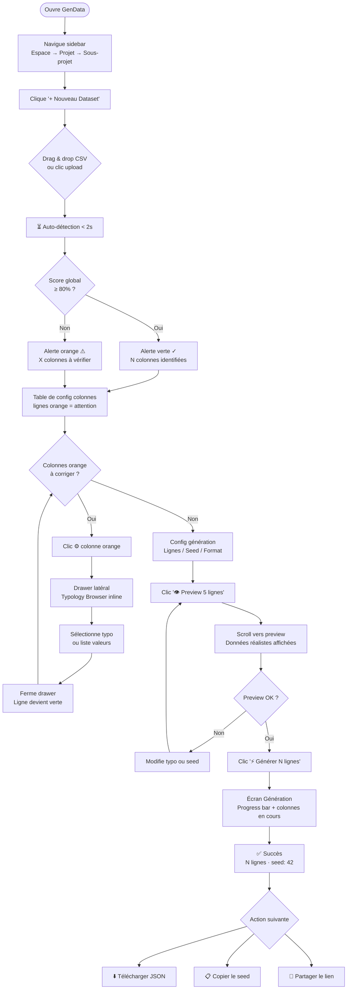
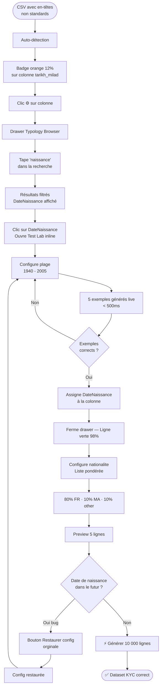
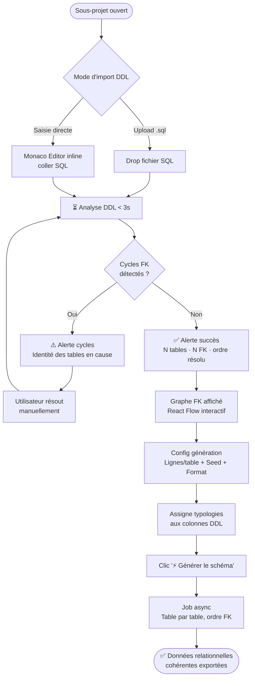
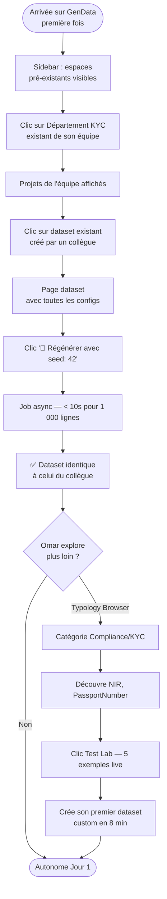
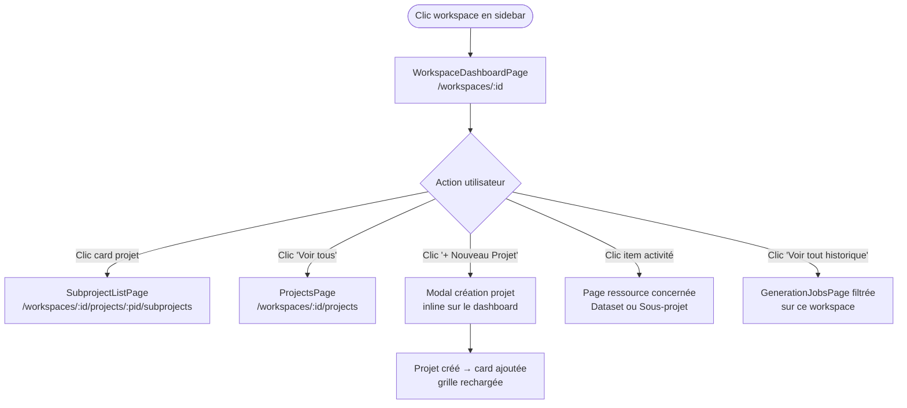

# UX Design Specification — GenData

**Author:** Nouredine
**Date:** 26 mars 2026

---

## Résumé Exécutif

### Vision Projet

GenData est une plateforme interne de génération de jeux de données de test, conçue pour 1000+ développeurs et ingénieurs QA bancaires. L'outil transforme un simple fichier CSV en dataset réaliste configurable via 112 typologies bancaires. Seed de reproductibilité garanti. Évolution commerciale SaaS prévue.

### Utilisateurs Cibles

| Profil | Volume | Objectif principal |
|---|---|---|
| Développeur | ×600 | Génération rapide locale, faible expertise données |
| QA Engineer | ×300 | Volumes importants, reproductibilité critique |
| Test Automation | ×50 | Intégration CI/CD, seed déterministe |
| QA Lead | ×50 | Gouvernance, standards, templates partagés |

### Défis UX Clés

1. Masquer la complexité des 112 typologies sans sacrifier la puissance
2. Feedback immédiat sur la configuration (preview live)
3. Découvrabilité fluide dans un catalogue étendu

### Opportunités de Design

1. Onboarding zero-friction : CSV → résultat en < 30 secondes
2. Test Lab contextuel : voir le rendu sans interrompre le workflow
3. Collaboration : partage de datasets et templates entre équipes

---

## Expérience Utilisateur Principale

### Définition de l'Expérience

L'action principale que l'utilisateur effectue le plus fréquemment dans GenData est :

> **"Je veux générer un dataset réaliste pour mon projet, maintenant, sans friction."**

La structure hiérarchique **[N1] → Projet → Sous-projet → [Dataset | DDL]** organise le travail de 1000 utilisateurs en reflétant leur organisation réelle. L'utilisateur navigue dans **son contexte métier** et génère des données **ancrées dans ce contexte**.

> **Premier niveau configurable** — Le libellé du premier niveau est libre : chaque workspace choisit son terme (`Tribu`, `Département`, `Équipe`, `Domaine`, `BU`, ou tout autre nom). Ce choix est fait à la création du workspace et peut être modifié dans les paramètres. Dans la documentation et les exemples, on utilise `Tribu` par convention, mais aucun terme n'est imposé.

Deux modes de génération coexistent dans un sous-projet :

| Mode | Point d'entrée | Cas d'usage |
|---|---|---|
| **Dataset** | CSV upload ou configuration manuelle | Données tabulaires colonne par colonne |
| **DDL** | Upload `.sql` ou éditeur SQL inline | Populate complet d'un schéma relationnel |

### Stratégie de Plateforme

- **Web app uniquement** — React TypeScript, desktop-first (1920×1080), responsive jusqu'à tablette
- **Mouse/keyboard** principalement (devs et QA sur poste de travail)
- **No offline** — outil interne, réseau d'entreprise
- **Navigation partageable** — chaque Tribu / Projet / Dataset a une URL stable (deep-link)

### Interactions Sans Friction

Ces 5 actions doivent être **absolument sans friction** :

1. **Naviguer dans sa tribu** — sidebar persistante avec arbre Tribu/Projet/Sous-projet toujours visible, expansion d'un clic
2. **Créer un Dataset** — depuis n'importe quel niveau de l'arbre : bouton `+` contextuel, CSV drag & drop, détection auto en < 2 secondes
3. **Importer un DDL** — drag & drop `.sql` OU coller le SQL directement dans l'éditeur inline, visualisation immédiate du graphe de dépendances
4. **Prévisualiser les données** — Test Lab live : changer un paramètre → résultat mis à jour instantanément (< 500ms)
5. **Retrouver un dataset** — recherche full-text dans le contexte de la tribu + filtres (projet, sous-projet, date, auteur)

### Moments Critiques de Succès

| Moment | Critère de succès |
|---|---|
| **Onboarding (1ère utilisation)** | CSV uploadé → dataset généré en < 30 secondes, sans lecture de doc |
| **Import DDL** | Graphe des FK affiché < 3 secondes → utilisateur comprend les dépendances |
| **Reproduction d'un bug** | Seed retrouvé → données identiques régénérées en 2 clics |
| **Partage équipe** | Collègue reçoit le lien → accède au dataset en 1 clic (pas de re-configuration) |
| **Power user** | Configuration avancée (corrélations, distributions) accessible sans quitter le workflow principal |

### Structure de Navigation Principale

```
┌─────────────────────────────────────────────────────────┐
│  GenData                        [🔍 Recherche] [👤 Nouredine] │
├──────────────┬──────────────────────────────────────────┤
│ SIDEBAR      │  CONTENU PRINCIPAL                       │
│              │                                          │
│ 🏛️ Tribu A   │  📂 Sous-projet : Virements SEPA          │
│  📁 Projet 1 │  ┌─────────┐  ┌─────────┐               │
│   📂 S-P 1.1 │  │📊Dataset│  │🗄️ DDL    │ [+ Nouveau]   │
│ ▸ 📂 S-P 1.2 │  │  virement│  │  schema │               │
│  📁 Projet 2 │  │  _test   │  │  sepa   │               │
│              │  │ 1000 rows│  │ 5 tables│               │
│ 🏛️ Tribu B   │  │ seed:42  │  │ + graph │               │
│  ...         │  └─────────┘  └─────────┘               │
│              │                                          │
│ [+ Tribu]    │                                          │
└──────────────┴──────────────────────────────────────────┘
```

### Principes d'Expérience

1. **Contexte d'abord** — L'utilisateur travaille toujours dans le contexte de sa Tribu/Projet. Jamais de vue "fourre-tout" globale comme landing.
2. **Voir avant de générer** — Aucune action irréversible sans preview. Test Lab et graphe DDL toujours disponibles avant le `[Générer]`.
3. **Zéro rupture de workflow** — Configuration typologies, preview, export : tout dans la même page, sans navigation hors contexte.
4. **Reproductibilité visible** — Le seed est toujours affiché et copiable. La traçabilité n'est pas optionnelle, elle est dans la UI.
5. **Progressive disclosure** — Mode simple (auto-detect) et mode expert (config manuelle) dans la même interface, niveau de détail révélé à la demande.

---

## Réponses Émotionnelles Souhaitées

### Objectifs Émotionnels Principaux

| Moment | Émotion cible |
|---|---|
| Découverte / Onboarding | **"Wow, c'est simple."** — Surprise positive, sentiment de compétence immédiate |
| Génération réussie | **"C'est exactement ce qu'il me faut."** — Satisfaction, confiance dans les données |
| Navigation Tribu/Projet | **"Je suis chez moi."** — Appartenance, orientation dans son espace de travail |
| Mode DDL / Power features | **"Cet outil me comprend."** — Empowerment, sentiment d'être un expert |
| Reproduction de données (seed) | **"Je maîtrise."** — Contrôle, sérénité face aux bugs |

### Parcours Émotionnel

```
Arrivée          →  Exploration      →  1ère génération  →  Usage régulier
"Où suis-je ?"      "Ah, ma tribu !"    "C'est magique !"   "Je connais l'outil"
 Curiosité           Appartenance        Surprise + joie      Confiance + fluidité
```

**Si quelque chose va mal :**
- Erreur DDL → Message clair, suggestion de correction → **Contrôle** (pas de frustration)
- Génération lente → Progress bar avec étapes visibles → **Patience acceptable** (pas d'anxiété)

### Micro-Émotions

| À favoriser ✅ | À éviter ❌ |
|---|---|
| Confiance (validation visible, seed affiché) | Doute (les données semblent-elles vraies ?) |
| Sentiment de progression (wizard clair) | Confusion (trop d'options d'un coup) |
| Délight (auto-detect qui "devine" la bonne typo) | Frustration (attendre sans feedback) |
| Appartenance (espace Tribu personnalisé) | Isolement (catalogue global sans contexte) |
| Fierté (partager un dataset bien structuré) | Honte (données évidemment fausses/absurdes) |

### Implications de Design

- **Confiance** → Afficher les checksum IBAN valide ✓, preview des 5 premières lignes avant génération bulk
- **Appartenance** → Avatar de la Tribu, compteur de membres, "Votre équipe a généré 42 datasets ce mois"
- **Délight** → Animation subtile quand l'auto-detect identifie une typo avec > 95% de confiance
- **Contrôle** → Seed toujours visible, bouton "Réutiliser ce seed", historique des générations
- **Progression** → Wizard en étapes numérotées pour les nouveaux, raccourcis pour les experts

### Principes de Design Émotionnel

1. **Féliciter avant d'informer** — "Dataset généré avec succès ! (1000 lignes, seed: 42)" avant les détails techniques
2. **L'erreur n'est pas une faute** — Messages d'erreur en langage humain avec solution proposée, jamais de stack trace brute
3. **L'espace Tribu = identité** — Chaque tribu a une couleur/icône, l'utilisateur se sent dans "son" outil
4. **La donnée générée doit sembler vraie** — Preview avec noms français réels, IBAN commençant par FR, montants cohérents — jamais "John Doe" ou "123-456"

---

## Analyse UX & Inspirations

### Produits Inspirants

**DBT (Data Build Tool) / dbt Cloud**
- Navigation par projet dans une sidebar persistante — exactement notre modèle Tribu/Projet
- Graphe de dépendances des modèles SQL → inspiration directe pour la **visualisation DDL FK**
- Mode code + mode visuel coexistent sans friction

**Mockaroo**
- Référence pour la génération de données de test, preview colonne par colonne bien exécuté → à adopter
- Catalogue plat sans organisation équipe → **notre différenciateur principal** (Tribu/Projet)

**GitHub / GitLab**
- Modèle mental Org → Repo → Branch très proche de Tribu → Projet → Sous-projet
- Sidebar de navigation + breadcrumb + deep-links URL stables → **pattern à adopter tel quel**

**Figma**
- Organisation Team → Project → File = notre modèle exact
- Thumbnails/cards de ressources en grille dans la vue projet → **inspiration directe pour les cards Dataset/DDL**
- Collaboration visible : avatars des contributeurs sur chaque ressource

### Patterns Transférables

| Pattern | Source | Application dans GenData |
|---|---|---|
| Sidebar arborescente persistante | VSCode / DBT | Navigation Tribu → Projet → Sous-projet |
| Graphe de dépendances interactif | DBT Lineage | Visualisation FK du DDL |
| Thumbnails de ressources en grille | Figma | Cards Dataset/DDL dans la vue Sous-projet |
| URL deep-linkable par ressource | GitHub | Partage direct d'un Dataset ou DDL |
| Breadcrumb contextuel | GitHub | Localisation dans la hiérarchie |
| Preview live inline | Mockaroo | Test Lab colonne → résultat instantané |
| Code editor + drag & drop | Mixte | Import DDL : éditeur SQL OU upload fichier |

### Anti-Patterns à Éviter

| Anti-pattern | Pourquoi l'éviter |
|---|---|
| **Landing = catalogue global** (style Mockaroo) | Perd le contexte équipe, noyé dans 1000 datasets |
| **Wizard multi-pages avec navigation** | Rompt le workflow, perd l'état intermédiaire |
| **Modal pour chaque action** | Surcharge cognitive, bloque la vue principale |
| **Paramètres cachés derrière "Avancé"** | Frustrant pour les power users quotidiens |
| **Pas de feedback pendant la génération** | Anxiété sur les volumes importants |

### Stratégie d'Inspiration

- **Adopter** : Sidebar arborescente (VSCode/DBT), graphe DDL (DBT), deep-links (GitHub), cards ressources (Figma)
- **Adapter** : Preview de Mockaroo → enrichi avec seed visible et badges de validation
- **Innover** : La combinaison Dataset + DDL dans un même Sous-projet n'existe nulle part ailleurs

---

## Design System Foundation

### Choix : MUI v6 + Monaco Editor + React Flow

**Stack UI complète :**

| Librairie | Usage |
|---|---|
| **MUI v6** | Layout, formulaires, tables, navigation, Tree view |
| **@mui/x-data-grid** | Preview datasets — pagination virtuelle 1M lignes |
| **@mui/x-tree-view** | Sidebar Tribu → Projet → Sous-projet |
| **Monaco Editor** | Éditeur SQL inline pour import DDL |
| **React Flow** | Graphe de dépendances FK (tables DDL) |
| **react-jsonschema-form** | Formulaires typologies auto-générés depuis configSchema |
| **Recharts** | Graphiques métriques d'usage |

### Rationale

- DataGrid MUI natif couvre le preview de datasets avec virtualisation
- Monaco Editor (moteur VSCode) offre la coloration syntaxique SQL sans développement supplémentaire
- React Flow est la référence pour les graphes interactifs nœuds/arêtes (FK DDL)
- Compatible avec les 12 semaines de timeline — composants prêts, pas de dev from scratch

### Design Tokens

- **Couleur primaire** : `#1976d2` (MUI blue — confiance, bancaire)
- **Accent succès** : `#2e7d32` (vert — data générée valide)
- **Accent warning** : `#ed6c02` (orange — confidence auto-detect < 80%)
- **Fond sidebar** : `#f5f5f5` (gris clair — distinction contexte/contenu)
- **Typo** : Inter (lisibilité code + données tabulaires)

---

## 2. Expérience Utilisateur Centrale

### 2.1 Expérience Définissante

Si GenData devait être résumé en une seule action :

> **"Je dépose mon CSV. En 30 secondes, j'ai un dataset bancaire réaliste, reproductible, prêt à l'emploi."**

C'est l'action que les 1 000 utilisateurs décriraient à leurs collègues. Tous les autres modes (DDL, Typology Browser, APIs) sont de la puissance supplémentaire. Mais ce flux — **CSV → auto-détect → corriger les 2 colonnes en orange → générer** — doit être parfait.

### 2.2 Modèle Mental Utilisateur

| Ce que l'utilisateur pense | Ce que GenData lui donne |
|---|---|
| "Mon CSV = mes colonnes — je veux juste les remplir" | Vue colonne par colonne, une ligne par colonne, rien de superflu |
| "Je ne connais pas les 112 typologies" | L'auto-détect devine → il confirme seulement les 2 lignes surlignées en orange |
| "J'ai besoin de vraies données bancaires, pas de 'John Doe'" | Preview immédiat : `FR76...`, `TXN-2024-...`, `1 250,50 EUR` |
| "Et si je régénère plus tard, j'aurai les mêmes données ?" | Seed `42` toujours visible, badge permanent, bouton "Réutiliser ce seed" |
| "Mes collègues utilisent-ils les mêmes données que moi ?" | URL partageable par seed + config — reproduction en 1 clic |

**Solution actuelle des utilisateurs (avant GenData) :**
- Scripts Python Faker ad hoc par développeur → pas reproductibles, pas partagés
- CSV statiques réutilisés → obsolètes, pas à l'échelle
- Données de production masquées → risque légal, pas conformes RGPD

Ce que les utilisateurs apprécient dans ces approches : **la familiarité** (leur propre CSV). GenData doit partir du CSV utilisateur — pas d'un formulaire générique.

### 2.3 Critères de Succès Core Experience

| Critère | Seuil |
|---|---|
| CSV uploadé → auto-détection affichée | < 2 secondes |
| Première génération lancée (sans assistance) | < 5 minutes depuis l'arrivée sur la page |
| Colonnes correctement identifiées sans intervention | ≥ 80% (score auto-détect ≥ 80%) |
| Preview données réalistes (pas "Lorem ipsum") | 100% — IBAN FR76, montants cohérents, dates valides |
| Seed visible en permanence | Toujours affiché, jamais caché derrière un clic |
| Régénération d'un collègue via seed | ≤ 2 clics depuis la réception du lien |

**Indicateurs de succès émotionnel :**
- L'utilisateur n'ouvre pas la documentation
- L'utilisateur partage le seed spontanément (valeur perçue)
- L'utilisateur revient à GenData pour son prochain sprint sans être encouragé

### 2.4 Patterns Établis vs. Patterns Innovants

| Interaction | Nature | Source / Rationale |
|---|---|---|
| Sidebar arborescente N1 → Projet → Sous-projet | **Établi** | VSCode, DBT — adopter tel quel, modèle mental connu |
| Table colonne par colonne avec badge de confiance coloré | **Innovant** | Mockaroo adapté — le code couleur orange/vert est le signal clé |
| FK Graph interactif nœuds/arêtes | **Établi** (DBT lineage) | Adopter le pattern React Flow, adapter au contexte DDL |
| Test Lab inline — preview live changement de paramètre | **Innovant** | Aucun équivalent direct — panneau contextuel sans navigation |
| Seed permanent visible + badge reproductibilité | **Innovant** | Différenciateur GenData — la reproductibilité est un objet UI de premier rang |
| Label N1 configurable (⚙ dans la sidebar) | **Innovant** | Enterprise-first naming — le panel jaune est le bon pattern (élégant et discret) |
| URL deep-linkable par ressource | **Établi** | GitHub — adopter tel quel |

### 2.5 Mécaniques d'Expérience — Flux CSV → Génération

#### Initiation
- Point d'entrée : bouton `+ Nouveau Dataset` (page Sous-projet) **ou** bouton `+` contextuel dans la sidebar
- Déclencheur alternatif : drag & drop d'un `.csv` directement sur la zone de contenu
- Le sous-projet actif est déjà sélectionné — aucune saisie de contexte requise

#### Interaction
```
[Drop CSV]  →  spinner 1,5s  →  alerte info "6/8 colonnes identifiées (94%)"

[Table de config]
  ├── 6 lignes vertes : typo assignée, confiance > 80% → pas d'action requise
  └── 2 lignes orange : confiance < 80% → highlight visuel, action suggérée
         ↓ clic ⚙️ sur colonne orange
         [Drawer latéral] → recherche de typo OU liste de valeurs personnalisée
         ↓ fermeture du drawer → ligne verte, confiance mise à jour

[Config génération]
  ├── Nombre de lignes : input numérique (défaut : 1 000)
  ├── Seed : input numérique visible et modifiable (défaut : valeur aléatoire)
  └── Format export : JSON (défaut) | CSV

[Preview 5 lignes]
  └── Scroll automatique vers la section preview en bas de page
      Données réalistes affichées : FR76..., TXN-..., 1 250,50 EUR
      Bouton [🔄 Régénérer] pour changer le seed à la volée

[Générer N lignes]
  └── Navigation vers la page de progression (async)
      Progress bar + étapes colonnes visibles
      Badge seed toujours affiché
```

#### Feedback
- Lignes **vertes** = typologies validées (aucune action requise)
- Lignes **orange** = attention requise (surlignage fond + badge avertissement)
- Preview live = données qui "semblent vraies" avant la génération bulk
- Progress bar avec % + liste colonnes traitées pendant le job async
- Notification succès : *"Dataset généré avec succès ! 1 000 lignes · seed: 42"* avant tout détail technique

#### Complétion
- État final : écran de succès avec 4 actions primaires :
  1. ⬇️ Télécharger JSON
  2. 📋 Copier le seed
  3. 👁️ Prévisualiser
  4. 🔗 Partager le lien
- Le seed est affiché en grand dans un encart bleu clair — jamais caché
- Retour possible vers la config en 1 clic ("Modifier et régénérer")

### 2.6 Incohérences Maquette Identifiées et Corrigées

Audit réalisé lors du step 7 — corrections appliquées à `prjdocs/mockup/index.html` :

| ID | Incohérence | Correction appliquée |
|---|---|---|
| IC-01 | `SQL INSERT` dans le select d'export (Screen 2) — Phase 2 uniquement selon PRD | Retiré du select — JSON et CSV uniquement (MVP) |
| IC-02 | Bouton "Preview" naviguait vers l'écran Génération au lieu d'afficher le preview inline | Corrigé : scroll vers `#preview-anchor` dans la page courante |
| IC-03 | Card DDL fantôme `id="ddl-card-1"` avec `display:none` dans le DOM (doublure morte) | Supprimé — une seule card DDL avec `data-tab="ddl"` |
| IC-04 | Stat card `seed:42 / Dernier seed utilisé` au niveau Sous-projet — le seed est propre à chaque dataset | Remplacé par `2h / Dernier téléchargement` (métrique pertinente au niveau Sous-projet) |
| IC-05 | Aucun menu contextuel sur les cards au hover | Ajouté : bouton `···` révélé au hover → dropdown (Régénérer, Copier lien, Exporter, Archiver) |
| IC-06 | Onglets Datasets/DDL/Historique non synchronisés avec le filtre des cards affichées | Corrigé : `data-tab` sur chaque card + `switchSubTab()` JS filtre dynamiquement |
| IC-07 | Bouton `+ Nouvelle Tribu` partiellement géré — propagation label déjà fonctionnelle | Vérifié conforme — `applyLabel()` propage correctement |

**Amélioration UX apportée :** Le menu contextuel `···` sur les cards répond au besoin opérationnel de Karim (Parcours 3 — gestion des datasets) sans surcharger l'interface au repos.

---

## 3. Fondation Visuelle

### 3.1 Système de Couleurs

Palette sémantique dérivée du contexte bancaire interne — aucune guideline de marque externe imposée. Couleurs extraites et validées depuis la maquette `prjdocs/mockup/index.html`.

| Token | Valeur | Usage |
|---|---|---|
| `primary` | `#1565c0` | Actions principales, focus, liens actifs |
| `primary-hover` | `#1976d2` | Hover states boutons primaires |
| `primary-pale` | `#e3f2fd` | Backgrounds actifs, badges sémantiques, sidebar actif |
| `surface` | `#ffffff` | Cards, panels, modals |
| `background` | `#f5f5f5` | Fond page, sidebar |
| `border` | `#e0e0e0` | Séparations, contours cards |
| `border-hover` | `#90caf9` | Hover cards, focus visible |
| `success` | `#2e7d32` | Données valides (✓ IBAN, ✓ généré, boutons génération) |
| `success-pale` | `#e8f5e9` | Alertes succès, badges "Généré" |
| `warning` | `#f57c00` | Confiance auto-detect < 80%, colonnes à corriger |
| `warning-pale` | `#fff3e0` | Surlignage lignes orange, chips typo incertaines |
| `error` | `#d32f2f` | Erreurs critiques, cycles FK détectés |
| `text-primary` | `#1a1a2e` | Titres, contenu principal |
| `text-secondary` | `#757575` | Métadonnées, labels secondaires |
| `text-disabled` | `#9e9e9e` | Placeholders, états inactifs (décoratif uniquement) |
| `seed-bg` | `#f5f5f5` / border `#e0e0e0` | Badge seed — identité "reproductibilité" |
| `sql-dark` | `#1e272c` | Éditeur Monaco DDL (dark theme) |
| `sql-keyword` | `#80cbc4` | Mots-clés SQL (teal) |

**Ratios de contraste WCAG AA :**

| Combinaison | Ratio | Conformité |
|---|---|---|
| `#1565c0` sur `#ffffff` | 5,9:1 | ✅ AA |
| `#2e7d32` sur `#ffffff` | 5,4:1 | ✅ AA |
| `#757575` sur `#ffffff` | 4,6:1 | ✅ AA |
| `#9e9e9e` sur `#ffffff` | 2,9:1 | ⚠️ Décoratif uniquement — jamais texte fonctionnel |
| `#1a1a2e` sur `#ffffff` | 17,5:1 | ✅ AAA |

### 3.2 Système Typographique

**Police principale : Inter** (Google Fonts) — lisibilité bureau optimale pour données et code.  
**Police monospace : Roboto Mono** — données tabulaires, seeds, code SQL.

| Niveau | Taille | Poids | Usage |
|---|---|---|---|
| Page Title | 28px | 800 | Titres écrans principaux |
| Section Title | 22px | 700 | Titres cards, panels |
| Sub-section | 16px | 700 | Toolbar titles, group headers |
| Body | 13px | 400 | Contenu courant |
| Body Strong | 13px | 600 | Labels actifs, métadonnées importantes |
| Caption | 12px | 400 | `card-meta`, timestamps, descriptions |
| Label Uppercase | 11px | 700 | Section-label, en-têtes colonnes (letter-spacing 0.7px) |
| Monospace | 13px | 400 | Données tabulaires, seeds, IBAN, SQL |

**Rationale :** 13px corps = densité bureau pour développeurs (pas d'espacement blog). Monospace différencie visuellement "UI" de "données" — signal de confiance sur la qualité des données générées.

### 3.3 Espacement et Layout

**Unité de base : 4px** (grille MUI par défaut)

| Token | Valeur | Usage |
|---|---|---|
| `space-xs` | 4px | Gap inter-icônes, padding dense |
| `space-sm` | 8px | Gap composants proches |
| `space-md` | 12px | Padding intérieur cards compactes |
| `space-lg` | 16px | Padding standard (cards, panels) |
| `space-xl` | 20px | Padding section principale, page-header |
| `space-2xl` | 24px | Séparations entre blocs majeurs |
| `space-3xl` | 32px | Padding centrage (génération async) |

**Structure de layout Desktop (1920×1080 cible) :**

```
┌─────────────────────────────────────────────────────────────┐
│  TOPBAR      48px fixe · z-index 100 · background #1565c0  │
├──────────────┬──────────────────────────────────────────────┤
│  SIDEBAR     │  CONTENT AREA                                │
│  260px fixe  │  flex: 1 · padding 24px                     │
│  bg #ffffff  │  overflow-y: auto                           │
│  overflow-y  │  max-width: aucun (plein écran bureau)       │
│  auto        │                                              │
└──────────────┴──────────────────────────────────────────────┘
```

**Principes de layout :**
1. **Densité bureau** — padding 12-16px sur les cards (pas 24px+ des sites marketing)
2. **Sidebar fixe et permanente** — jamais collapsable sur desktop, le contexte = l'identité de l'utilisateur
3. **Content scrollable** — la sidebar est l'ancre fixe, le contenu principal défile
4. **Grid auto-fill** — `repeat(auto-fill, minmax(280px, 1fr))` sur les cards pour s'adapter au redimensionnement

### 3.4 Considérations Accessibilité

| Critère | Niveau cible | Implémentation |
|---|---|---|
| Contraste texte | **WCAG AA** | Tous textes fonctionnels ≥ 4.5:1 |
| Focus visible | **WCAG AA** | Ring `#1565c0` sur tous éléments interactifs |
| Navigation clavier | **AA** | Sidebar, table config, drawers — tab order logique |
| ARIA labels | **AA** | `aria-label` sur badges confiance, `aria-checked` sur toggles, `aria-valuenow` + `aria-valuemax` sur progress bar génération |
| Taille cible tactile | Minimum 32×32px | Même desktop-first, tous boutons ≥ 32px |
| Texte décoratif | Annotation | `#9e9e9e` = décoratif uniquement, jamais seul porteur d'information |

**Note :** L'outil est desktop-first (bureau développeur/QA), mais les cibles tactiles 32px assurent la compatibilité tablette pour les Parcours 3 et 5 (gestion et onboarding en mobilité).

---

## 4. Direction Design

### 4.1 Directions Explorées

La direction design a été validée directement via la maquette interactive 5 écrans (`prjdocs/mockup/index.html`) plutôt que par des variations successives — la maquette constituant déjà une exploration complète et itérée.

### 4.2 Direction Choisie : **Dense & Trustworthy**

Une direction bureautique, bancaire et professionnelle — la **confiance** avant l'esthétique.

| Dimension | Choix | Rationale |
|---|---|---|
| **Layout** | Sidebar 260px fixe + content plein écran | Contexte = identité de l'utilisateur, jamais caché |
| **Densité** | Dense (13px corps, padding 16px) | Développeurs et QA habitués aux IDEs, pas aux landing pages |
| **Hiérarchie visuelle** | Topbar bleu foncé → Sidebar blanc → Cards | 3 niveaux visuels distincts = orientation immédiate sans doc |
| **Couleur dominante** | `#1565c0` Blue 800 | Confiance bancaire, action clairement identifiable |
| **Signal de qualité** | Vert `#2e7d32` sur données valides | ✓ IBAN, ✓ généré = feedback de validation métier |
| **Signal d'attention** | Orange `#f57c00` sur lignes incertaines | Guidage actif sans bloquer le workflow |
| **Monospace omniprésent** | Roboto Mono sur données et seeds | "Ces données semblent vraies" — délight développeur |
| **Dark editor DDL** | Monaco `#1e272c` | Familiarité IDE — "cet outil me comprend" |

### 4.3 Ce que la Direction Évite Délibérément

- Pas de gradients décoratifs ni d'effets visuels complexes
- Pas d'espacement marketing (white space excessif)
- Pas de couleurs pastel douces (signal outil grand-public)
- Pas de navigation hamburger sur desktop

### 4.4 Approche d'Implémentation

Stack confirmée alignée avec la direction :
- **MUI v6 Blue 800** comme primary — conforme à la palette
- **Monaco Editor** pour le DDL — immersion IDE
- **React Flow** pour le graphe FK — clarté relationnelle
- **MUI DataGrid** pour les previews — densité tableau native

---

## 5. Flux de Parcours Utilisateurs

### 5.1 Flux 1 — Yann : CSV → Génération (parcours nominal)



### 5.2 Flux 2 — Fatima : Correction manuelle + Test Lab



### 5.3 Flux 3 — Mode DDL (schéma relationnel)



### 5.4 Flux 4 — Omar : Onboarding zero-friction



### 5.5 Patterns de Navigation Transversaux

| Pattern | Occurrences | Standard d'implémentation |
|---|---|---|
| **Drawer latéral contextuel** | Correction typo, Test Lab, config colonne | Slide-in depuis la droite — sans navigation hors page |
| **Alerte guidante colorée** | Auto-detect, DDL analysé, job terminé | Vert = valide · Orange = action requise · Rouge = bloquant |
| **Seed permanent visible** | Config dataset, preview, écran succès | Toujours affiché — jamais derrière un clic ou un toggle |
| **Progression async visible** | Jobs génération, analyse DDL | Progress bar + état par colonne/table en cours |
| **Retour arrière non destructif** | Restaurer config originale, annuler typo | Aucune action irréversible sans confirmation explicite |
| **Deep-link URL stable** | Partage dataset, navigation historique | Chaque ressource a une URL permanente et partageable |

---

## 6. Stratégie Composants

### 6.1 Couverture Design System MUI v6

| Composant MUI | Usage dans GenData |
|---|---|
| `TreeView` (@mui/x) | Sidebar Espace → Projet → Sous-projet |
| `DataGrid` (@mui/x) | Preview datasets — virtualisation 1M lignes |
| `Dialog` / `Drawer` | Drawer latéral contextuel (config colonne, Test Lab) |
| `Tabs` | Onglets Datasets / DDL / Historique dans Sous-projet |
| `LinearProgress` | Progress bar génération async |
| `Chip` | Badges catégorie typologies, labels pondération |
| `Table` | Configuration colonnes |
| `TextField` / `Select` | Inputs config (lignes, seed, format) |
| `Alert` | Alertes auto-detect, DDL analysé, erreurs |
| `Tooltip` | Aide contextuelle sur badges confiance |
| `Breadcrumbs` | Navigation Espace > Projet > Sous-projet |
| `IconButton` | Boutons `⚙️`, `+`, `···` |
| `Snackbar` | Notifications job terminé |

### 6.2 Composants Personnalisés

#### C-01 : `ConfidenceBadge`
**Rôle :** Afficher le score d’auto-détection avec codage couleur  
**États :** `high` (≥80%, vert `#2e7d32`) · `medium` (50-79%, orange `#f57c00`) · `low` (<50%, rouge `#d32f2f`)  
**ARIA :** `aria-label="Confiance {valeur}%"` + `role="status"`

#### C-02 : `SeedBadge`
**Rôle :** Afficher le seed de manière permanente et copiable  
**États :** `default` · `copied` (animation ✓ 1,5s)  
**Interaction :** clic → copie clipboard → feedback visuel  
**ARIA :** `aria-label="Seed de reproductibilité: {valeur}. Cliquer pour copier"`

#### C-03 : `TypologyChip`
**Rôle :** Afficher la typologie assignée à une colonne  
**États :** `validated` (bleu `#e3f2fd`) · `warning` (orange `#fff3e0`) · `manual` (violet pâle)  
**Interaction :** clic → ouvre drawer Typology Browser filtré sur cette colonne

#### C-04 : `ColumnConfigRow`
**Rôle :** Ligne de la table de configuration colonnes  
**États :** `normal` (fond blanc) · `attention` (fond `#fff8e1` + highlight orange) · `locked` (FK DDL)  
**Anatomie :** `#` · `col-name` · `TypologyChip` · `ConfidenceBadge` · toggle Nullable · toggle Unique · btn `⚙️`

#### C-05 : `FKGraphCanvas` (React Flow)
**Rôle :** Graphe de dépendances FK entre tables DDL  
**États nœud :** `parent` (vert, sans FK entrantes) · `child` (bleu) · `selected` (border highlight)  
**Interaction :** drag repositionnement · hover FK → tooltip `TABLE_A.col → TABLE_B.col`

#### C-06 : `GenerationProgressCard`
**Rôle :** État d’un job async  
**États :** `pending` · `running` (progress bar + colonnes en cours) · `completed` · `failed`  
**ARIA :** `role="progressbar"` + `aria-valuenow` + `aria-valuemax`

#### C-07 : `LabelSettingsPanel`
**Rôle :** Configurer le libellé du N1 configurable  
**États :** `closed` / `open` — révélé par clic `⚙` dans sidebar header  
**Anatomie :** chips prédéfinis (Tribu, Département…) + input libre + bouton OK

### 6.3 Stratégie d’Implémentation

| Couche | Approche |
|---|---|
| **Foundation** | MUI v6 tokens + design tokens GenData en CSS variables |
| **Composants custom** | `styled(MuiComponent)` ou composants fonctionnels React — jamais valeurs hardcodées |
| **Cohérence** | Tous les composants consomment les tokens `primary`, `success`, `warning` |
| **Accessibilité** | ARIA sur C-01 à C-07 dès le premier commit |
| **Tests** | Storybook pour les composants C-01 à C-07 — stories par état |

### 6.4 Roadmap Composants

| Phase | Composants | Justification |
|---|---|---|
| **Sprint 1** | `ColumnConfigRow`, `ConfidenceBadge`, `TypologyChip` | Cœur du flux CSV → Config |
| **Sprint 2** | `SeedBadge`, `GenerationProgressCard` | Flux génération async |
| **Sprint 3** | `FKGraphCanvas`, `LabelSettingsPanel` | Mode DDL + Admin |

---

## 7. Patterns UX de Cohérence

### 7.1 Hiérarchie des Boutons

| Niveau | Apparence | Usage | Exemple |
|---|---|---|---|
| **Primaire** | `bg #1565c0` blanc, border-radius 6px | Action principale unique par vue | `⚡ Générer`, `+ Nouveau Dataset` |
| **Succès** | `bg #2e7d32` blanc | Validation irréversible (génération bulk) | `⚡ Générer 1 000 lignes` |
| **Secondaire** | `bg white`, border `#1565c0`, texte bleu | Action secondaire, réversible | `👁️ Preview`, `📋 Importer CSV` |
| **Ghost / Icon** | Fond transparent, icône seule | Actions de gestion discrètes | `⚙️`, `+`, `···` |
| **Danger** | Texte `#f44336`, fond transparent | Actions destructrices dans dropdowns | `🗑️ Archiver` |

**Règle :** une seule action primaire visible par page. Jamais deux boutons primaires en concurrence.

### 7.2 Patterns de Feedback

| Situation | Composant | Couleur | Message type |
|---|---|---|---|
| Succès opération | `Alert` verte + `Snackbar` | `#e8f5e9` / `#2e7d32` | "Dataset généré avec succès ! 1 000 lignes · seed: 42" |
| Info / Guidage | `Alert` bleue | `#e3f2fd` / `#1565c0` | "Auto-détection : 6/8 colonnes identifiées (94%)." |
| Attention requise | `Alert` orange | `#fff3e0` / `#f57c00` | "2 colonnes nécessitent une vérification manuelle." |
| Erreur récupérable | `Alert` rouge | `#fce4ec` / `#d32f2f` | "Cycle FK détecté entre `compte` et `virement`. Résolvez avant de générer." |
| Progression async | `GenerationProgressCard` | Barre bleue animée | "730 / 1 000 lignes générées (73%) — colonne status..." |

**Règles :**
- Féliciter **avant** d’informer — le titre est toujours positif si l’action a réussi
- Jamais de stack trace brute exposée — toujours un message humain avec suggestion
- `Snackbar` disparaît après 5s pour les succès, reste jusqu’à fermeture manuelle pour les erreurs

### 7.3 Patterns de Formulaires

| Élément | Règle |
|---|---|
| **Label** | Toujours au-dessus de l’input (pas de placeholder comme seul label) |
| **Validation** | Inline au blur (pas au submit) — `HelperText` rouge sous l’input |
| **Champs requis** | Astérisque rouge `*` + mention « * Champs requis » en bas du formulaire |
| **Valeurs par défaut** | `seed` = valeur aléatoire pré-remplie · `lignes` = 1 000 · `format` = JSON |
| **Inputs numériques** | Flèches haut/bas désactivées — saisie directe uniquement |
| **Width** | Inputs contextuels (seed, lignes) : largeur fixe adaptée au contenu attendu |

### 7.4 Patterns de Navigation

| Pattern | Règle |
|---|---|
| **Sidebar** | Toujours visible sur desktop. Item actif = fond `#e3f2fd`, texte `#1565c0` |
| **Breadcrumb** | Présent sur toutes les vues. Dernier élément non-cliquable (page courante) |
| **Onglets** | Soulignement bleu 2px sur l’onglet actif. Contenu filtré immédiatement au clic |
| **Deep-links** | URL synchronisée avec la navigation — copier l’URL = partager le contexte exact |
| **Retour** | Jamais de bouton « Retour » explicite — breadcrumb + sidebar suffisent |

### 7.5 Patterns États Vides et Chargement

| État | Affichage |
|---|---|
| **Liste vide** | Icône illustrative + message contextuel + CTA `[+ Créer le premier Dataset]` |
| **Chargement initial** | Skeleton loaders (MUI `Skeleton`) — pas de spinner global |
| **Chargement inline** (auto-detect) | `CircularProgress` 16px dans la colonne Confiance |
| **Erreur de chargement** | Message inline + bouton « Réessayer » — pas de page d’erreur complète |

### 7.6 Patterns Recherche et Filtrage

| Contexte | Pattern |
|---|---|
| **Typology Browser** | Search temps réel (debounce 300ms) + chips de filtre par catégorie |
| **Liste datasets** | Recherche full-text dans le contexte Sous-projet uniquement (jamais global cross-espace) |
| **Réinitialisation** | Bouton « Effacer les filtres » visible uniquement quand un filtre est actif |

### 7.7 Patterns Modales et Overlays

| Cas | Composant | Règle |
|---|---|---|
| Config colonne (typo + Test Lab) | `Drawer` latéral 400px | Slide-in droite — la table reste visible à gauche |
| Confirmation action destructive | `Dialog` centré | Titre explicite + bouton danger + bouton annuler |
| Label N1 configurable | Panel inline sidebar | Pas de modal — contextuel et discret |
| Aide / documentation | `Tooltip` enrichi | Au hover sur badges confiance et icônes techniques |

**Règle :** les `Dialog` sont réservés aux confirmations destructives. Tout le reste = `Drawer` ou panels inline.

---

## 8. Responsive Design & Accessibilité

### 8.1 Stratégie Responsive

| Plateforme | Stratégie | Justification |
|---|---|---|
| **Desktop 1440–1920px** | Plein écran, sidebar fixe 260px, content sans max-width | Cas d’usage primaire — IDEs, DataGrids, Monaco Editor |
| **Desktop 1280–1440px** | Identique — layout fluide | Résolutions courantes en entreprise |
| **Tablette ≥1024px** | Même layout, touch targets 44px minimum | Karim (Parcours 3) gestion en mobilité |
| **Tablette <1024px** | Sidebar collapsable en overlay (hamburger) | Consultation uniquement — pas de config colonnes |
| **Mobile <768px** | **Hors scope MVP** — page « outil non disponible sur mobile » | Workflow incompatible avec écran mobile |

**Décision explicite :** Pas de mobile MVP. À documenter dans le périmètre produit pour éviter des demandes futures imprévues.

### 8.2 Stratégie de Breakpoints

```
Mobile   < 768px    → hors scope MVP
Tablet   768–1023px → sidebar en overlay, touch-optimisé
Desktop  1024px+    → layout principal — sidebar fixe, plein écran
Wide     1440px+    → même layout, espace absorbé par content grid
```

**Approche : Desktop-first** avec `@media (max-width: 1023px)` pour les adaptations tablette.

### 8.3 Stratégie Accessibilité — WCAG 2.1 AA

| Critère | Implémentation |
|---|---|
| **Contraste** | Tous les textes fonctionnels ≥4,5:1 (cf. section 3.1) |
| **Navigation clavier** | Tab order logique dans sidebar, table de config, drawers. Pas de trap clavier sauf modals |
| **Focus visible** | Ring `#1565c0` 2px offset 2px sur **tous** les éléments interactifs — jamais `outline: none` sans alternative |
| **Screen readers** | HTML sémantique : `<nav>`, `<main>`, `<aside>`, `<table>`. ARIA uniquement quand HTML insuffisant |
| **ARIA critique** | `aria-label` sur icônes seules · `role="progressbar"` + `aria-valuenow` · `aria-checked` sur toggles · `aria-expanded` sur sidebar |
| **Tailles tactiles** | Minimum 32×32px desktop, 44×44px tablette |
| **Animations** | Respecter `prefers-reduced-motion` — désactiver animations de progression si demandé |
| **Langue** | `lang="fr"` sur `<html>` |

### 8.4 Adaptations Tablette Clés

| Composant | Adaptation tablette |
|---|---|
| **Sidebar** | Overlay au-dessus du contenu — bouton hamburger dans la topbar |
| **Table config colonnes** | Défilement horizontal — colonnes Config/Nullable/Unique cachables |
| **Monaco Editor DDL** | Fonctionnel — touch keyboard acceptable pour l’usage tablette |
| **React Flow FK Graph** | Pinch-to-zoom activé — déplacement tactile |
| **DataGrid preview** | Défilement tactile natif — `overflow-x: auto` |

### 8.5 Stratégie de Tests

**Responsive :**
- Chrome DevTools breakpoints 1024px, 1280px, 1440px, 1920px
- Vrai appareil tablette (iPad ou équivalent pro) pour le Parcours 3

**Accessibilité :**
- `cypress-axe` en CI — rapport automatique à chaque PR
- Test manuel VoiceOver (macOS) sur les 3 flux critiques (CSV → Génération, DDL, Typology Browser)
- Navigation clavier uniquement validée sur les 5 parcours PRD
- Contraste : Storybook + addon `@storybook/addon-a11y`

---

## 9. Dashboard Workspace

### 9.1 Contexte et Déclencheur

**Comportement actuel :** Clic sur un workspace dans la sidebar → `navigate('/workspaces/:id/projects')` → ProjectsPage (liste de projets brute).

**Comportement cible :** Clic sur le nom du workspace → `navigate('/workspaces/:id')` → `WorkspaceDashboardPage` — vue synthétique complète avant d'entrer dans un projet.

**Intention UX :** Donner à l'utilisateur une "page d'accueil de son espace" — sentiment de **"Je suis chez moi"** (émotion cible définie en section 2). Le workspace n'est plus un simple nœud de navigation mais un **espace vivant** avec son activité, ses membres et ses métriques.

**Route :** `/workspaces/:workspaceId` → `<WorkspaceDashboardPage />`  
**Déclencheur sidebar :** ligne 51 de `Sidebar.tsx` — changer `navigate('/workspaces/${workspace.id}/projects')` → `navigate('/workspaces/${workspace.id}')`

---

### 9.2 Anatomie du Dashboard

```
┌─────────────────────────────────────────────────────────────────────┐
│  TOPBAR  48px · bleu #1565c0                                        │
├──────────────┬──────────────────────────────────────────────────────┤
│  SIDEBAR     │  PAGE HEADER                                          │
│  260px       │  🏛️ [labelN1] · [Nom workspace]                       │
│              │  8 membres · créé mars 2026                          │
│  ▶ [ws actif]│  ──────────────────────────────────────────────────  │
│    Proj 1    │                            [+ Nouveau Projet] [⚙ ···]│
│    Proj 2    ├──────────────────────────────────────────────────────┤
│  ▸ ws B      │  KPI CARDS (4 cards · flex row · gap 16px)           │
│              │  ┌───────────┐ ┌───────────┐ ┌───────────┐ ┌───────┐│
│              │  │ Projets   │ │ Datasets  │ │Lignes gén.│ │Activité│
│              │  │           │ │           │ │           │ │       ││
│              │  │    12     │ │   148     │ │   2,4 M   │ │  2 h  ││
│              │  │ ▲+2/mois  │ │▲+12/sem.  │ │▲+340k/mois│ │ ago   ││
│              │  └───────────┘ └───────────┘ └───────────┘ └───────┘│
│              ├──────────────────────────────────────────────────────┤
│              │  PROJETS                           [Voir tous (12) →]│
│              │  ┌──────────────┐ ┌──────────────┐ ┌─────────────┐  │
│              │  │ 📁 KYC       │ │ 📁 Virements  │ │ 📁 Fraude   │  │
│              │  │ 3 sous-proj. │ │ 2 sous-proj.  │ │ 1 sous-proj.│  │
│              │  │ 42 datasets  │ │ 18 datasets   │ │ 7 datasets  │  │
│              │  │ ⏱ 30 min    │ │ ⏱ 2 jours    │ │ ⏱ 1 semaine│  │
│              │  └──────────────┘ └──────────────┘ └─────────────┘  │
│              │  (max 6 cards, triés par activité récente)           │
│              ├──────────────────────────────────────────────────────┤
│              │  ACTIVITÉ RÉCENTE                                     │
│              │  ─── Aujourd'hui ───────────────────────────────────  │
│              │  ✅ Yann  ·  KYC / Clients  ·  dataset_v2  · 1 000 ↓│
│              │  ✅ Fatima · Virements / SEPA · schema_test · 5 tab. │
│              │  ─── Hier ──────────────────────────────────────────  │
│              │  ✅ Omar  ·  KYC / NIR      ·  first_dataset · 500 ↓ │
│              │                              [Voir tout l'historique] │
└──────────────┴──────────────────────────────────────────────────────┘
```

---

### 9.3 KPI Cards — Métriques Workspace

| Card | Valeur principale | Delta | Source API |
|---|---|---|---|
| **Projets** | Nombre total de projets | `+N ce mois` | `WorkspaceTree.projects.length` |
| **Datasets** | Total datasets générés (tous projets) | `+N cette semaine` | `GET /api/workspaces/:id/stats` |
| **Lignes générées** | Total cumulé de lignes (formaté : 2,4 M) | `+N ce mois` | `GET /api/workspaces/:id/stats` |
| **Dernière activité** | Timestamp relatif (ex : "2 h") | — | `GET /api/workspaces/:id/stats` |

**Règles d'affichage :**
- Valeur principale : `28px / 800` (Page Title token)
- Delta : `12px / 400` texte secondaire `#757575` — si positif, préfixe `▲` vert `#2e7d32`
- Fond card : `#ffffff` · border `#e0e0e0` · border-radius 8px · padding 20px
- Hover : border `#90caf9` (border-hover token)

**Endpoint à créer :**
```
GET /api/workspaces/:id/stats
→ {
    projectCount: number,
    datasetCount: number,
    totalRowsGenerated: number,
    lastActivityAt: string,       // ISO 8601
    datasetsDeltaMonth: number,
    datasetsDeltaWeek: number,
    rowsDeltaMonth: number
  }
```

---

### 9.4 Section Projets

**Affichage :** Grille `repeat(auto-fill, minmax(260px, 1fr))` — maximum 6 cards visibles  
**Tri :** Par dernière activité (dataset généré le plus récent en premier)  
**CTA :** `[Voir tous (N) →]` en haut à droite → navigue vers `/workspaces/:id/projects`  

**Anatomie d'une `WorkspaceProjectCard` :**

```
┌─────────────────────────────────────┐
│  📁  [Nom du projet]            [···]│
│  ─────────────────────────────────  │
│  3 sous-projets · 42 datasets       │
│  ⏱ Actif il y a 30 min             │
│                                     │
│  [Ouvrir →]                         │
└─────────────────────────────────────┘
```

- `[···]` menu contextuel au hover → `Renommer`, `Archiver`
- `[Ouvrir →]` → `navigate('/workspaces/:id/projects/:projectId/subprojects')`
- Clic sur la card entière = même action que `[Ouvrir →]`

**État vide :** Aucun projet → illustration + `[+ Créer le premier projet]` centré

---

### 9.5 Section Activité Récente

**Affichage :** Liste chronologique groupée par jour (max 10 entrées, lien vers historique complet)

**Types d'événements affichés :**
| Icône | Type | Description |
|---|---|---|
| ✅ | `DATASET_GENERATED` | Dataset généré avec succès |
| 📤 | `DATASET_EXPORTED` | Téléchargement déclenché |
| 🗄️ | `DDL_GENERATED` | Schéma DDL généré |
| 📁 | `PROJECT_CREATED` | Nouveau projet créé |
| 📂 | `SUBPROJECT_CREATED` | Nouveau sous-projet créé |

**Anatomie d'un item :**
```
[avatar]  Prénom  ·  [Projet / Sous-projet]  ·  [nom ressource]  ·  [N lignes ↓]  ·  [il y a Xh]
```

**Endpoint à créer :**
```
GET /api/workspaces/:id/activity?limit=10
→ [{
    actorName: string,
    actorInitials: string,
    eventType: 'DATASET_GENERATED' | 'DATASET_EXPORTED' | 'DDL_GENERATED' | 'PROJECT_CREATED' | 'SUBPROJECT_CREATED',
    projectName: string,
    subprojectName: string,
    resourceName: string,
    rowCount?: number,
    tableCount?: number,
    occurredAt: string   // ISO 8601
  }]
```

---

### 9.6 Header Workspace et Actions Rapides

**Anatomie du page header :**

```
[🏛️]  [labelN1] · [Nom du workspace]
       [N membres] · Créé [mois année]
                                       [+ Nouveau Projet]  [⚙ ···]
```

- `labelN1` configurable (Tribu / Département / Équipe / etc.) — `Body Strong 13px/600`
- Nom workspace — `Section Title 22px/700`
- `[+ Nouveau Projet]` = bouton primaire → modal création projet
- `[⚙ ···]` = menu contextuel → `Paramètres workspace`, `Gérer les membres`, `Archiver`

**Breadcrumb :** `GenData > [labelN1] [Nom workspace]` — dernier élément non-cliquable

---

### 9.7 Flux de Navigation Depuis le Dashboard



---

### 9.8 Composants Nouveaux

| Composant | Rôle | Base |
|---|---|---|
| `WorkspaceDashboardPage` | Page complète dashboard | Nouvelle page React |
| `WorkspaceKPICard` | Card métrique (4 instances) | `styled(MuiCard)` |
| `WorkspaceProjectCard` | Card projet avec stats inline | Extension cards existantes |
| `WorkspaceActivityFeed` | Liste activité groupée par jour | Composant liste MUI |
| `WorkspacePageHeader` | Header avec nom, membres, actions | `styled(Box)` + `IconButton` |

**Intégration App.tsx — nouvelle route :**
```tsx
// Ajouter AVANT /workspaces/:workspaceId/projects
<Route path="/workspaces/:workspaceId" element={<WorkspaceDashboardPage />} />
```

**Modification Sidebar.tsx ligne 51 :**
```tsx
// Avant
navigate(`/workspaces/${workspace.id}/projects`);
// Après
navigate(`/workspaces/${workspace.id}`);
```

---

### 9.9 États et Cas Limites

| État | Affichage |
|---|---|
| **Chargement initial** | Skeletons sur KPI cards + grille projets (MUI `Skeleton`) |
| **Aucun projet** | Zone projets : illustration + `[+ Créer le premier projet]` |
| **Aucune activité** | Zone activité : texte discret + CTA |
| **Erreur API stats** | KPI cards affichent `—` avec tooltip "Données indisponibles" |
| **1 seul projet** | 1 card projet + card `[+ Nouveau Projet]` en pointillés |
| **>6 projets** | 6 cards visibles + lien `[Voir tous (N) →]` |

---

### 9.10 Alignement avec les Principes Existants

| Principe | Application dans le Dashboard |
|---|---|
| **Contexte d'abord** | Dashboard = contexte workspace complet avant d'entrer dans un projet |
| **Voir avant de générer** | Activité récente visible sans navigation — ce qui a été produit |
| **Zéro rupture de workflow** | Dashboard comme hub — chaque élément est un raccourci direct |
| **Reproductibilité visible** | Items d'activité montrent le seed au hover (tooltip) |
| **Progressive disclosure** | Dashboard vue simple → clic card projet → détail progressif |

---

## Annexe: Designs Alternatifs

### DDL Mode — Alternative Wizard (Option C)

Une alternative au Flux 3 (mode DDL) est en exploration. La conception proposée repense le workflow DDL autour d'un wizard 4-étapes avec divulgation progressive:

**Fichier:** `/prjdocs/planning-artifacts/ddl-mode-wizard-alternative.md`

**Approche:** Separates SQL import → validation → configuration → review pour réduire la charge cognitive et améliorer l'onboarding.

**Comparaison:** 
- **Courant (Flux 3):** Sequentiel, drawer modal, idéal power users
- **Alternative (Wizard):** Étapes progressives, accordion config, idéal onboarding + débutants

**Status:** Design specification v1.0 — prêt pour prototype/feedback utilisateur.

---
